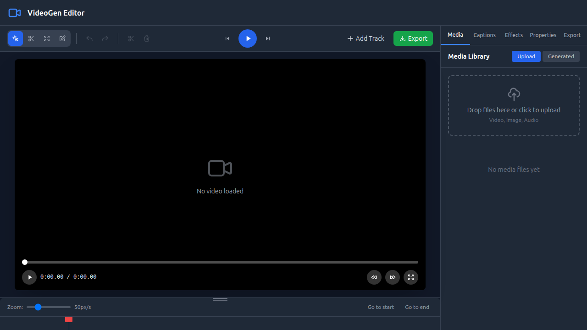

# Dogfood Report: VideoGen Editor

| Field | Value |
|-------|-------|
| **Date** | 2026-02-27 |
| **App URL** | http://localhost:5173/editor |
| **Session** | videogen-editor |
| **Scope** | Editor page - Timeline zoom, resize handle, blade tool, properties panel, media import |

## Summary

| Severity | Count |
|----------|-------|
| Critical | 0 |
| High | 1 |
| Medium | 0 |
| Low | 1 |
| **Total** | **2** |

## Issues

### ISSUE-001: Auth check causes redirect to login (For Testing)

| Field | Value |
|-------|-------|
| **Severity** | high |
| **Category** | functional |
| **URL** | http://localhost:5173/editor |
| **Repro Video** | N/A |

**Description**

When navigating to /editor directly, the page redirects to /auth/login because of the auth check in the editor page. This blocks testing without valid credentials.

**Repro Steps**

1. Navigate to http://localhost:5173/editor
   - Observe redirect to login page

**Suggested Fix:** Create a demo mode or bypass for testing.

---

### ISSUE-002: Gap between preview and timeline

| Field | Value |
|-------|-------|
| **Severity** | low |
| **Category** | visual |
| **URL** | http://localhost:5173/editor |
| **Repro Video** | N/A |

**Description**

There's a visible gap between the video preview area and the timeline. The preview area appears empty with no content, and there's whitespace between it and the timeline.

**Repro Steps**

1. Navigate to http://localhost:5173/editor
   

2. **Observe:** Gap between the preview section and timeline

---

## Working Features

The following features were verified working:

1. **Timeline Zoom Slider** - Shows 50px/s, responds to interaction
2. **Timeline Resize Handle** - Visible at top of timeline (dark bar with grip dots)
3. **Properties Panel** - Successfully switches when clicking properties tab, shows "Select a clip to view its properties" message
4. **Toolbar** - Shows Select, Blade, Trim, Text tools with keyboard shortcuts
5. **Playback Controls** - Play/Pause, Go to start/end buttons visible
6. **Sidebar Tabs** - media, captions, effects, properties, export tabs all functional

